# When Orange Chicken?

A simple, innocous question. While eating dinner, some friends and I were discussing the best Ike meals, eventually arriving at when is orange chicken next available at one of the Dining Halls littered around campus?


That sweet, sweet chicken

Any ordinary person on campus would tell you to pull out your phone, and click on each dining hall, then search for some of that delicious chicken. But instead, I thought, 

> What if you received a text message every time orange chicken was available at a dining hall?. 

And so that Monday evening, I started some investigative work.

## Detour to the world of email SMS


The first thing I looked at was how I could even send these SMS messages for cheap (or even free!). After some searching around, it appeared that no one wanted to let me send it from a *phone number* for free. However, there were projects that use the carrier specific sms emails to send your message.

The most popular of these is [textbelt](https://github.com/typpo/textbelt). 

In a nutshell, we configure an email provider to send email from, and then the library will send out our message as an email to a preconfigured list of email addresses where `%s` is the phone number you want a message to:

```js
  us: [
    '%s@email.uscc.net',
    '%s@message.alltel.com',
    '%s@messaging.sprintpcs.com',
    '%s@mobile.celloneusa.com',
    '%s@msg.telus.com',
    '%s@paging.acswireless.com',
    '%s@pcs.rogers.com',
    '%s@qwestmp.com',
    '%s@sms.ntwls.net',
    '%s@tmomail.net',
    '%s@txt.att.net',
    '%s@txt.windmobile.ca',
    '%s@vtext.com',
    '%s@text.republicwireless.com',
    '%s@msg.fi.google.com',

    // '%s@message.ting.com', // Duplicate of Sprint
    // '%s@sms.edgewireless.com',  // slow
  ],
```
(A snippet of https://github.com/typpo/textbelt/blob/master/lib/providers.js)

After some playing around, I was successfully sending texts!

[nestor screenshot picture]

Unfortunately, this method has some drawbacks:

1) You are sending from an email, which looks really suspicious
2) You are sending an email to ~20 carriers, when only one will get delivered.
3) This doesn't scale well

When I setup the email service, the easiest method was to connect my gmail account and use that as the SMS sender. I have since regretted that decision, as the 19/20 emails repeatedly bounce.

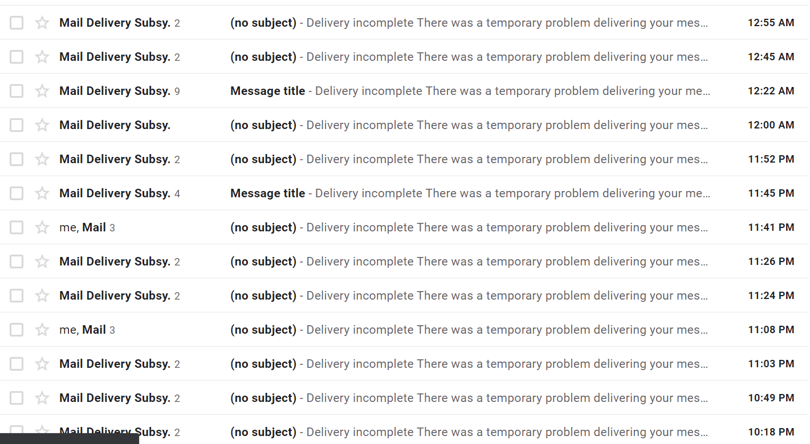
2 days after the experiment

I later switched to mailgun, but I was not able to get the texts, even though the emails sent. I concluded that there must be some security protection against this sort of SMS spam* (or idk how mailgun works)

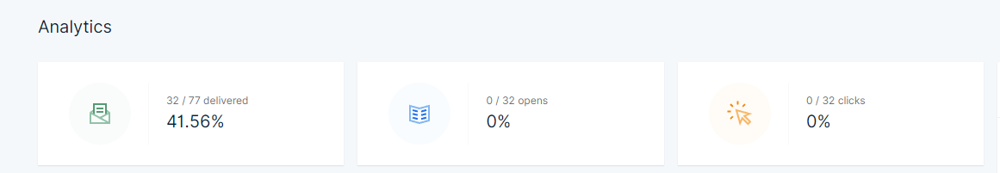

*This claim requires further research, and I had already spent an hour trying to get it to work, and so I moved onto more interesting parts of this project to determine it's feasibility.

## Playing around with web APIs

I then pivoted my attention towards the dining halls.


Top 10 photos taken before a steep academic decline

The first spot I checked was the dining hall information page. Nothing special, but it could get the job done.

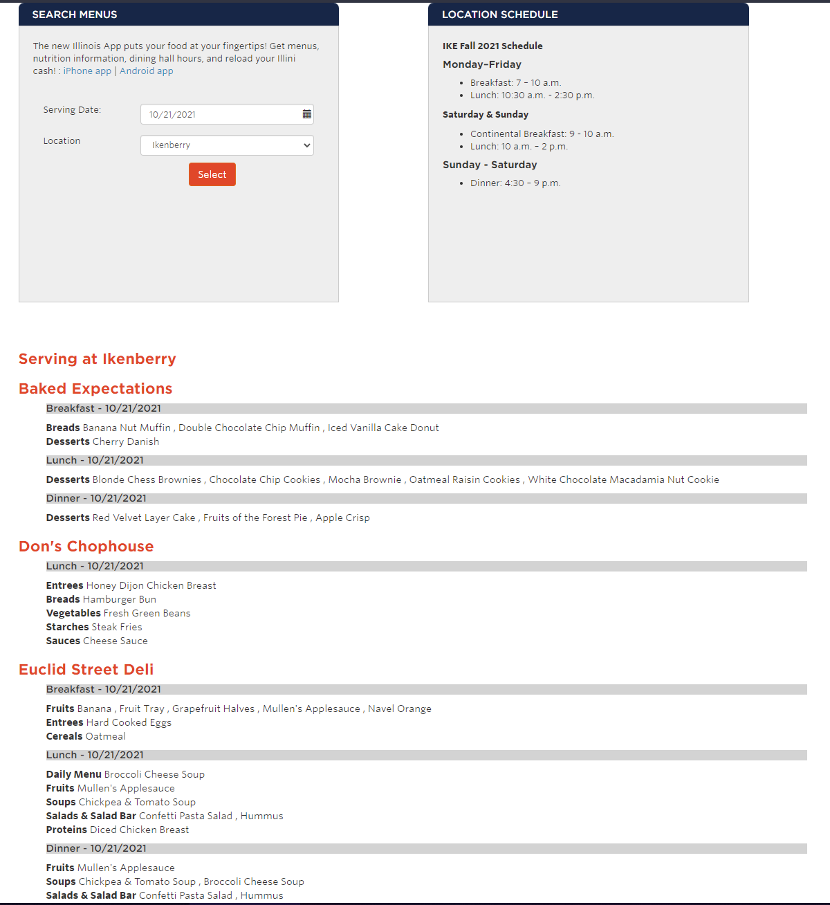
A true work of art

Unfortunately, after looking at the requests, we figure out that this is a .NET application and it doesn't use any APIs.

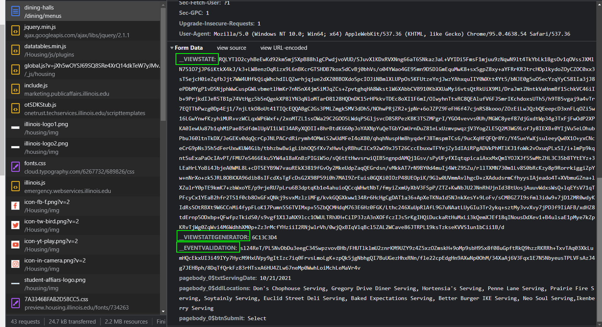
Debugger Tools showing the despair-inducing `__VIEWSTATE`.

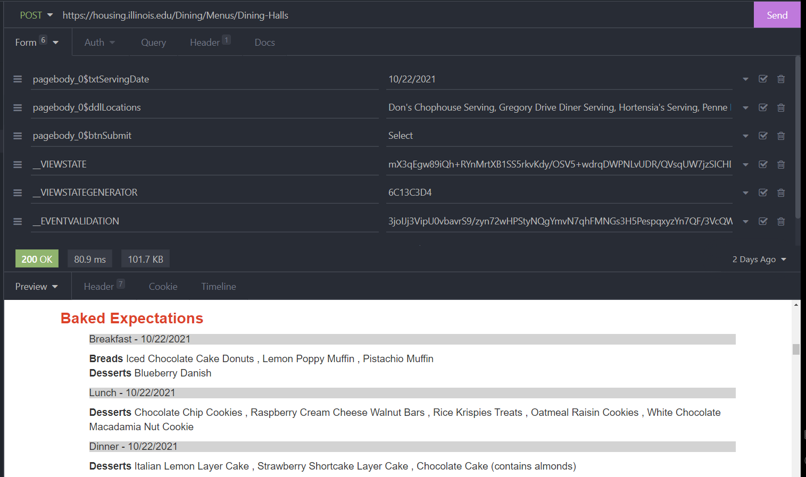

I was able to easily replicate this request in [Insomnia](https://insomnia.rest/), my favorite web request tester, showing the possibility of acquiring the data ahead of time.

I could have stopped here, and created a python script running to screen-scrape the menu and then send out emails. But  would I be a true software engineer if I did that?


## The Illinois Dining App

Most people at Illinois are familiar with the Illinois App: It shows you the locations and menu for all the dining halls. The app's information comes from somewhere, and that place is 99% of the time an API. 

Reverse-engineering closed-source APIs is pretty much my specialty, and I really enjoy doing it. I've done it lets see, [one](https://github.com/sec-edgar/sec-edgar), [two](https://github.com/reteps/lrc_kit), [three](https://github.com/reteps/kbot), [four](https://github.com/reteps/rundata), [five](https://github.com/reteps/redfin), [six](https://github.com/reteps/quizizz-bot), [seven](https://github.com/reteps/mcdonalds-api-wrapper), [eight](https://github.com/reteps/freenom-register), [nine](https://github.com/reteps/pywerschool) times and turned it into an open-source library. DATA EQUITY FTW!!

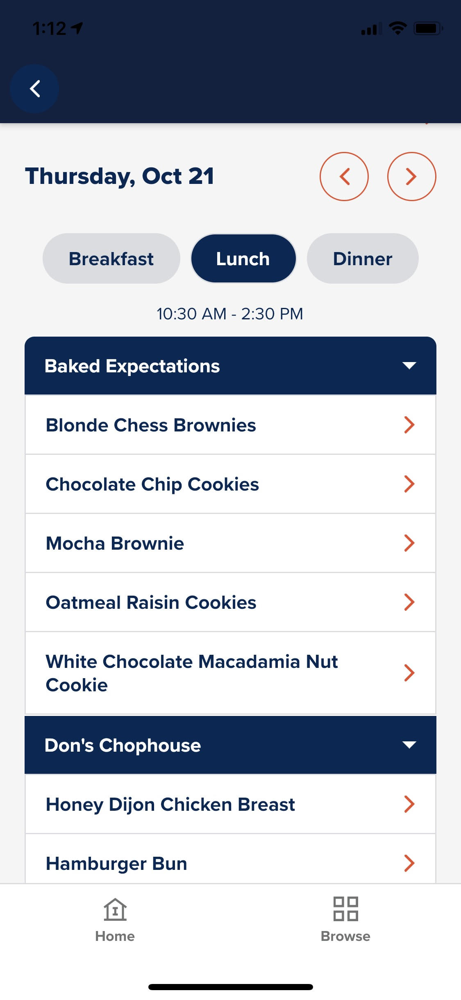
An image of the dining hall app for the IKE dining hall

Enter Charles.
 
 
A MITM (Man-in-the-middle) proxy for intercepting mobile requests. In the best case scenario, I can inspect the requests directly from Charles with no further work.

However, once we start intercepting requests, we see the spinner of death :(

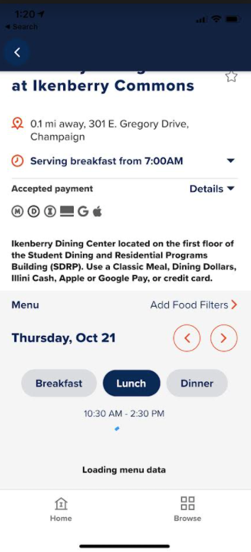

Pair the spinner with a suspiciously low number of requests made by the app, and we have a pretty strong case that SSL pinning is in place. SSL pinning is designed to protect against people like me who are trying to intercept (and possibly modify!) web traffic to a mobile app.

Luckily, two weeks ago, I did a deep dive into bypassing SSL Pinning on Snapchat. I won't go into detail of how to perform the same steps I did, but this blog by [HTTP Toolkit](https://httptoolkit.tech/blog/frida-certificate-pinning/) does a great job explaining how it can be bypassed.

In order,

1. Acquire Android Emulator w/ rooted android phone & install Frida
2. Install Burp Suite to monitor requests
3. Proxy requests you make on the emulator through burp suite to monitor traffic
4. Use the ~magic~ of Frida to bypass SSL pinning
5. Profit!!

Completing steps 1-3, I was able to confirm my hunch in the `adb logcat` output: SSL Pinning is stopping us from viewing what web pages it views.

*adb logcat output*

This output pretty clearly shows us that native libraries are involved in SSL pinning.

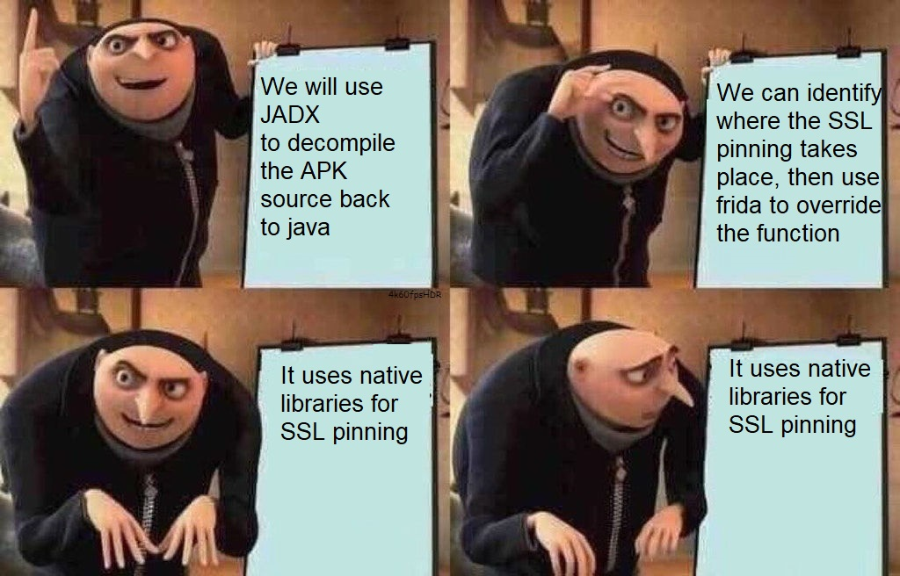
I cry every time


### Time to bring out the heavy artillery

After decompiling the source using [APKtool](https://ibotpeaches.github.io/Apktool/), we can identify that this application is actually written in Dart/Flutter (a fairly new mobile app programming language/platform for those not family).


After reading more into how the Dart VM works, I figured out that most of the business logic happens inside the shared object file `libapp.so`. This is a beast of a file: I am not interested in reverse-engineering a VM (a well-known obfuscation technique)

Since Flutter is such a new language, reverse-engineering support is sparse: [Doldrums](https://github.com/rscloura/Doldrums) seems to be our best bet, but our app version is too new for it to [work](https://github.com/rscloura/Doldrums/issues/9) :(


Luckily, we aren't the only person to attempt dart SSL bypassing:

*link to OG articles*

*code screenshots*

And after a TON of trial and error, we finally get it working!!!

*burp screenshot*

An]( find... unauthenticated mobile API endpoints!![[Pasted_image_20211021015012.png)

A nice prize after so much work :)

Mirroring these requests using Insomnia, we find two endpoints we care about:

The list of locations,
```
https://web.housing.illinois.edu/MobileAppWS/api/LocationSchedules
```
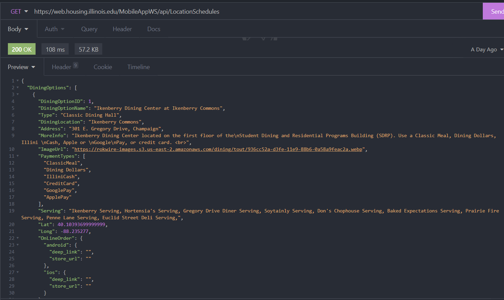

As well as the menu for that location on a certain day:
```
https://web.housing.illinois.edu/MobileAppWS/api/Menu/<diningID>/<date>
```
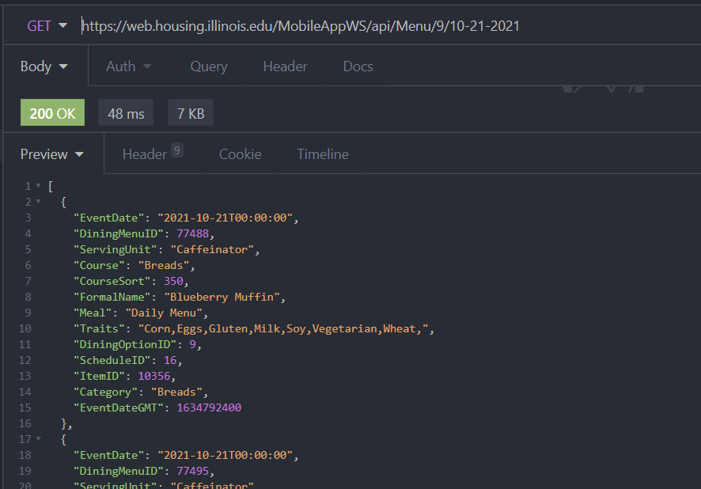

## Technology Stack and Planning

After this point, I decided that I wanted to turn this project into a full webapp. After some careful consideration, I ended up with a tech stack:

|Service|Used|Reasoning|
|------|-----|-----|
|SMS Messaging|Twilio|Cheapest rates for actual SMS
|Database|Firebase|I wanted to try a new technology for this project
|Front-End|React + Next.JS + MaterialUI|Familiar with React, wanted to try SSR (Next.JS)
|Hosting|Firebase hosting|Try it out
I also made some other decisions: Obviously this webapp would be able to do more than just Orange Chicken, will provide some needed customization, and I will try to store all the data I will need in `Firestore`, and use `Cloud Functions` for other tasks, like sending messages and fetching the menu for the day.


### Authentication

Authentication scares me, so I always do it first. I didn't really implement anything special, so I will just overview what I resarched instead. I looked into types of Illinois authentication, which boiled down to shibboleth, OpenID Connect, and Google. 


I don't think any explanation I make of the first two is going to be better than the official Illinois tech support guy, so:

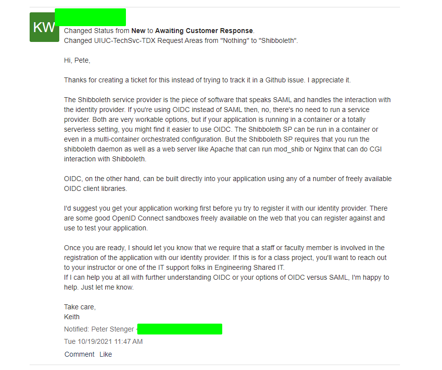

I decided to go with authentication method #3 because:

1) shibboleth authentication sounded hard to setup, and would require me to self-host something (I couldn't just use Firebase hosting)
2) I would need to build out the application *first*, before asking to register with OpenID Connect. [edit] Now that it is built, I could reach out...
3) Google Auth is built-in to firebase authentication, making it very easy

tldr; I am lazy

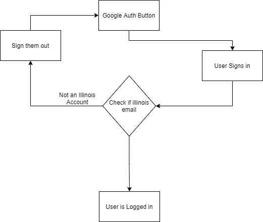

The authentication flow I ended up with

## Development Process

I forgot to take screenshots of the development process, sorry about that! If you want to see a more detailed view of the development process, please just view the [commit history](https://github.com/reteps/when-orange-chicken/commits/master) of my github repo :)
### Initial Baby Steps

As I said, I first implemented authentication. I then pushed the user to the Cloud Firestore database. Firestore is a NoSQL database, which means that there are no ForeignKeys or SQL-style querying allowed. Overall, I am happy with how much I learned and what I ended up with but it was confusing at times.

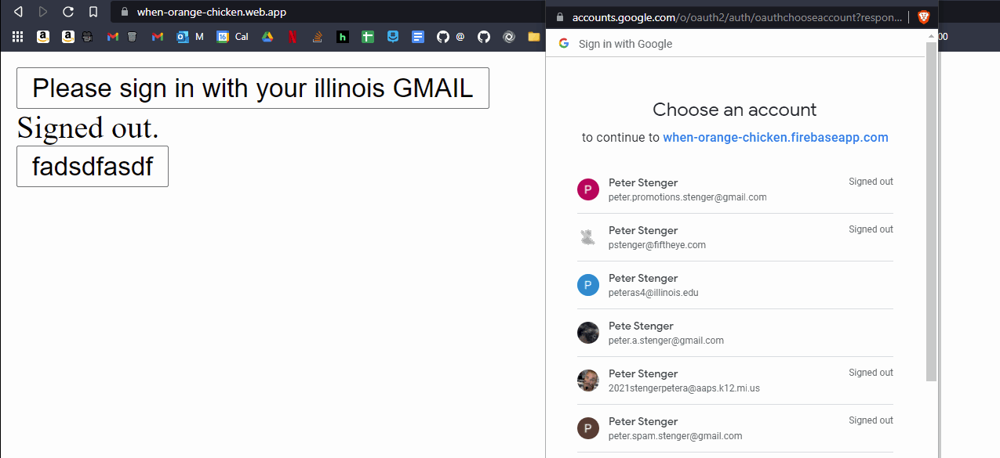
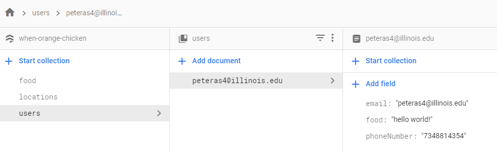

### Filling in the database

I then setup a cloud function to pull down data from the API every day at 1AM and into the database.

```js
export const updateMenu = functions.pubsub.schedule('0 1 * * *')
.onRun(async context => {
  const d = new Date();
  const today: string = d.toLocaleDateString().replace(/\//g, "-");
  const meals = await getFoodForDay(today);
  const items: Promise<any>[] = []

  for (let [mealTime, mealTimeEntries] of Object.entries(meals)) {
    db.collection(`food/${today}/meals`).doc(mealTime).set({
      name: mealTime
    })

    for (let [item, value] of Object.entries(mealTimeEntries)) {
      items.push(db.collection(`food/${today}/meals/${mealTime}/items`).doc(item).set(value as FirebaseFirestore.DocumentData))
    }
  }
  console.log(`Waiting for ${items.length} Items `)
  await Promise.all(items);
})
```

### UI Madness

Most of the UI development process went smoothly, I always forget how to use [MaterialUI](https://mui.com/) and so it takes me 2x as long to do basic things, like make a react button. I ended up using [styled-components](https://styled-components.com/), which made styling things way easier:

```js
styled(Container)`
 display: flex;
 flex-direction: row;
 justify-content: space-apart;
 `
 ```

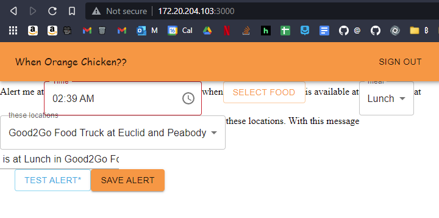
About half-way through the project.

React is great for most things, but what it is not known for is forms. This may have been the most infuriating two hours of my life to validate a phone number. The only advice I have to you is that while `useState` hooks can be annoying, integrating [react-hook-form](https://react-hook-form.com/) into a UI library is worse.

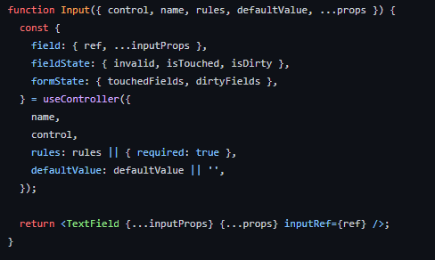
Ah yes, the joys of es6 javascript ...

### Re-engineering

As I built out the site more, I realized I would have to redo my original data structure:

```
root
- users
- food
   - breakfast
      - (DATE)
	    - food item 1
   - lunch
      - (DATE)
	    - food item 2
   - dinner
      - (DATE)
	    - food item 3
```

The main issue I was facing was in the UI, there was no easy way to display all food elements without performing a metric ton of queries.

After opening a couple tabs,
StackOverflow, where I got answered by this absolute legend: ![[Pasted_image_2021102102470)png]]

He gave me a pretty crazy looking path structure to use, `/food/{date_doc}/meals/{meal_doc}/items/{item_doc}`, but after thinking it out on paper, I figured out a data structure for the food elements, as well how to query for food in this structure based on my alerts.

When you use paper for programming, you know it's a complicated problem


### Final Strides

By Wednesday evening, I had already spent a ton of time on the project and wanted to finish it up soon.